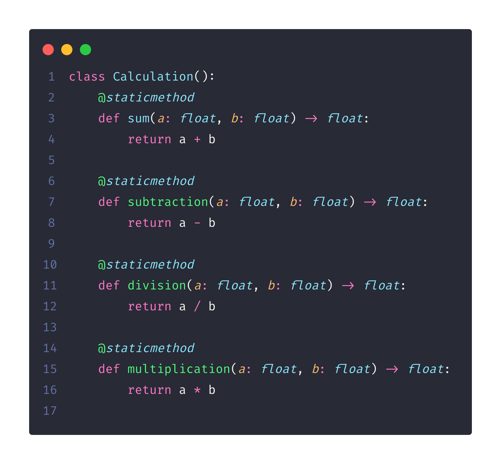
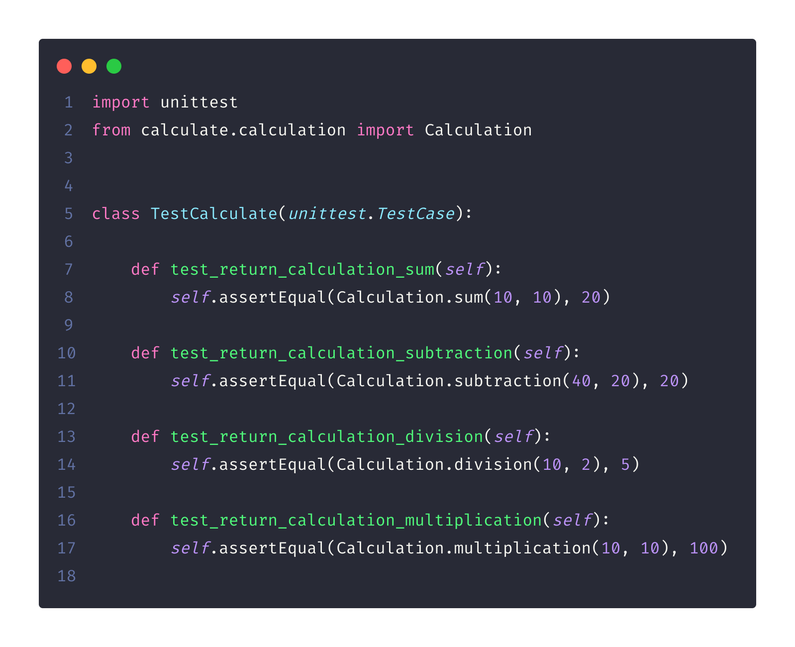
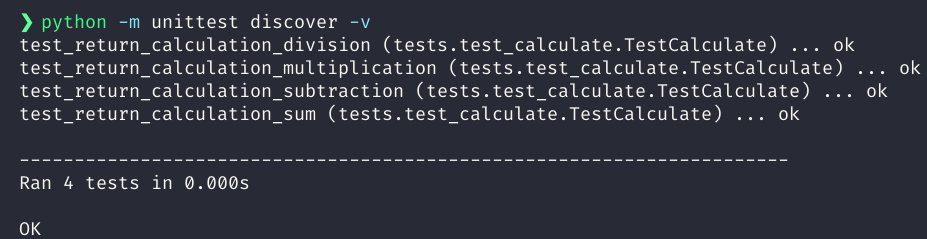

# Testing Calculations in Python, using OOP (Object-Oriented Programming)

### Create environment with venv

```
python3 -m venv venv
```

### Activate environment

```
. venv/bin/activate
```

### Run Tests in Python

```
python3 -m unittest discover -v
```

## Techs

> Python


## Class Calculation:



## TestingCalculation:





## Run Tests in Python

